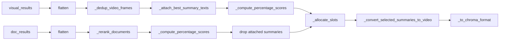

# PostProcessor / Reranker

`PostProcessor` in `providers/file_ingest_and_retrieve/reranker.py` sits between ChromaDB retrieval and the API response. It deduplicates video frames, reranks documents with a cross-encoder, merges results from multiple content types, and normalises the output format.

---

## Configurable Options

| Parameter | Default | Effect |
|-----------|---------|--------|
| `reranker_model` | _(required)_ | HuggingFace model ID or local OV IR directory name under `models/openvino/`. If the OV IR does not exist it is exported and saved automatically. |
| `device` | `"CPU"` | OpenVINO inference device (e.g. `"GPU"`, `"NPU"`). |
| `dedup_time_threshold` | `5.0` s | Two video frames from the same file within this temporal window are treated as duplicates; only the one with lower distance is kept. |
| `overfetch_multiplier` | `3` | Available for callers to overfetch candidates before post-processing (not used internally by `PostProcessor` itself). |
| `RRF_K` (module constant) | `60` | Controls how steeply RRF scores drop off with rank. Higher → more diversity; lower → top-rank items dominate more. |

---

## Entry Points

### `process_text_query_results(query, visual_results, doc_results, top_k)`

Pipeline: **dedup → attach summaries → rerank all docs → percentage scores → drop attached summaries → allocate slots → summary→video → format**

### `process_image_query_results(visual_results, top_k)`

Pipeline: **dedup → attach summaries → trim → assign RRF by rank → percentage scores → format**

No cross-encoder is invoked. After dedup, summary texts are attached to video results via `_attach_best_summary_texts`. Results are trimmed to `top_k`, assigned RRF scores by rank, then scored with `_compute_percentage_scores` (using the image-to-image sigmoid center) so the output format is consistent with the text path.

---

## Step Details

### 1. `_dedup_video_frames`

- Splits input into **video** (`meta.type == "video"`) and **non-video** (static images, pass-through).
- For each video file, sorts frames by `video_pin_second`, then does a linear scan:
  - If the current frame's timestamp is within `dedup_time_threshold` of the cluster leader, they are in the same cluster → keep whichever has the lower `distance`.
  - Otherwise, emit the cluster leader and start a new cluster.
- Final output is sorted by `distance` ascending (lower = more relevant). This ordering is relied on by `_allocate_slots` for RRF ranking.

### 2. `_attach_best_summary_texts`

- Iterates over deduped visual results; skips non-video items.
- Groups video results by `file_path`, then looks up precomputed summary IDs from `video_summary_id_map` and fetches their metadata from the document collection via `chroma_client.get()`.
- For each video result, finds the summary whose time range midpoint (`(start_time + end_time) / 2`) is closest to `video_pin_second` and attaches its `chunk_text` as `meta.summary_text`.
- This gives each video frame a textual description that can be displayed alongside the visual result.

### 3. `_rerank_documents`

- **All** document results (including video summaries) are scored by the cross-encoder as `[query, chunk_text]` pairs in a single batched inference call (max length 512 tokens).
- The raw logit is stored as `reranker_score` on each result.
- Scored documents are sorted by `reranker_score` descending. Documents without `chunk_text` are appended at the end in their original order without a score.
- Summaries compete alongside regular documents on an equal footing throughout the remaining pipeline steps.

### 4. `_compute_percentage_scores`

- Run on visual and document groups **separately, before allocation**.
- Since percentage scores are independent of RRF (they only depend on each result's own raw score), computing them before or after allocation produces identical values.
- Computing them early means scores are already present on items entering `_allocate_slots`, which allows a later step (drop attached summaries) to remove items without losing their scores.

Assigns a 0-100 **absolute relevance** score to each result. Each type has its own formula:

**Documents** (have `reranker_score` from the cross-encoder):

$$score = \sigma(reranker\\_score) \times 100$$

**Visual results** (text-to-image and image-to-image):

$$score = \sigma\bigl(k \cdot (cosine\\_sim - center)\bigr) \times 100$$

where `cosine_sim = 1 - distance` (ChromaDB cosine distance is in [0, 2]).

CLIP text-to-image and image-to-image similarities occupy very different ranges, so each query type uses its own sigmoid center:

| Constant                       | Value  | Purpose                                             |
| ------------------------------ | ------ | --------------------------------------------------- |
| `VISUAL_SIGMOID_K`             | `15.0` | Steepness (shared)                                  |
| `VISUAL_SIGMOID_CENTER_TEXT`   | `0.15` | Center for text-to-image queries (sim ~0.05-0.35)   |
| `VISUAL_SIGMOID_CENTER_IMAGE`  | `0.70` | Center for image-to-image queries (sim ~0.5-0.95)   |

Typical score ranges for relevant results:

| Type                   | Relevant | Moderate | Irrelevant |
| ---------------------- | -------- | -------- | ---------- |
| Document               | 85-99    | 50-85    | 0-30       |
| Visual text-to-image   | 80-95    | 30-80    | 0-20       |
| Visual image-to-image  | 80-97    | 30-80    | 0-20       |

### 5. Drop attached summaries

- Summaries whose `chunk_text` already appears as `summary_text` on a visual frame are removed from the document group **before allocation**.
- This prevents attached summaries from consuming document slots in `_allocate_slots`, ensuring allocation uses all `top_k` slots for genuinely distinct content.

### 6. `_allocate_slots`

Merges `visual` and `document` groups into a single ranked list of `top_k` items.

**RRF scoring** — each group is ranked independently (visual: by distance, document: by reranker_score). RRF score is assigned per item:

$$rrf\\_score = \frac{1}{k + rank}, \quad k = RRF\\_K = 60$$

**Two-pass selection:**

1. **Guarantee pass** — each group gets at least `min_per_group = max(1, top_k // (num_groups × 2))` slots, preventing a dominant group from starving others entirely.
2. **Fill pass** — remaining slots are filled globally by descending `rrf_score`.

After both passes, `selected` is re-sorted by `rrf_score` descending to produce a globally consistent ranking (the guarantee pass can insert items out of global order).

### 7. `_convert_selected_summaries_to_video`

- Runs **after** allocation. Attached summaries were already removed in step 5, so every summary here is unattached and should be converted.
- For each result whose metadata contains a `summary_key`:
  - Resolves `file_path` from `file_key`/bucket, sets `video_pin_second` to the midpoint of `[start_time, end_time]`, replaces metadata with `type: "video"` and `original_type: "constructed_from_summary"`, preserves `reranker_score`.
  - If `file_key`/bucket cannot be resolved, the summary is dropped.
- After this step, no `summary_key` documents remain in the output.

### 8. `_to_chroma_format`

Converts the flat result list back to ChromaDB nested format. Preserves the RRF ordering from `_allocate_slots` (does not re-sort by score, since scores are not comparable across types). Output fields:

| Field | Content | Direction |
|-------|---------|-----------|
| `ids` | result id list | — |
| `metadatas` | original metadata dicts | — |
| `distances` | raw ChromaDB cosine distance | lower = better |
| `scores` | absolute relevance per type (sigmoid-based, see above) | higher = better |
| `reranker_scores` | cross-encoder logit per result (`None` for visual items); **only present when at least one document result exists** | higher = better |

---

## Design: RRF for Result Diversity

### The problem

The system retrieves results from two fundamentally different modalities:

- **Visual** (video frames, images) — scored by CLIP cosine distance, where good text-to-image matches typically have similarity 0.15-0.35.
- **Documents** (text chunks) — scored by a cross-encoder reranker, producing logits that map to sigmoid scores of 85-99 for relevant results.

These raw scores are **not comparable**. Sorting by raw score would push all documents above all visual results (or vice versa), regardless of actual relevance. A user searching for "Newton's first law" should see a relevant video clip alongside a relevant textbook passage, not ten text results followed by ten videos.

### Why RRF

RRF (Reciprocal Rank Fusion) solves this by discarding raw scores entirely and working only with **rank position** within each group. The rank-2 image and rank-2 document get the same RRF score (`1/(K+2)`), regardless of their raw cosine distance or reranker logit. This guarantees fair interleaving across modalities.

Key properties:

- **Modality-agnostic** — no need to calibrate or normalise scores across different embedding spaces.
- **Diversity by construction** — the guarantee pass ensures every modality gets minimum representation; the fill pass lets the stronger modality claim remaining slots.
- **Stable under score drift** — if a model update shifts the raw score distribution, RRF ordering is unaffected as long as the within-group ranking is preserved.

### Why not sort by score

The absolute `score` field uses per-type sigmoid formulas to produce human-readable relevance values (see `_compute_percentage_scores`). These are useful for display and per-type quality filtering, but **not for cross-type ordering** because:

1. A document score of 90 (sigmoid of reranker logit) and a visual score of 90 (sigmoid of CLIP similarity) measure different things.
2. Sorting by score would collapse back to the original problem of one modality dominating.

Therefore, the final result list preserves **RRF order** and attaches `score` as a supplementary field.

### Tuning `RRF_K`

The constant `RRF_K = 60` controls how quickly RRF scores decay with rank:

| `RRF_K` | Rank 0 vs Rank 5 ratio | Effect                             |
| ------- | ---------------------- | ---------------------------------- |
| 10      | 10/15 = 1.50x          | Top ranks dominate heavily         |
| 60      | 60/65 = 1.08x          | Scores drop slowly, more diversity |
| 200     | 200/205 = 1.02x        | Nearly flat, almost round-robin    |

The default of 60 is a standard choice that balances relevance (top items still ranked higher) with diversity (lower-ranked items from one group can compete with mid-ranked items from another).

---

## Ordering vs Scores (summary)

- **Ordering** is determined by RRF — a rank-based method that fairly interleaves results from different modalities regardless of their raw score distributions.
- **Scores** are absolute relevance values per type. They reflect how semantically relevant each result is within its own modality, but are **not comparable across types** (a document score of 90 and a visual score of 90 do not mean the same thing).
- `distances` are absolute cosine distances and can be used for quality filtering (e.g. drop results with `distance > threshold`) independently of call context.
