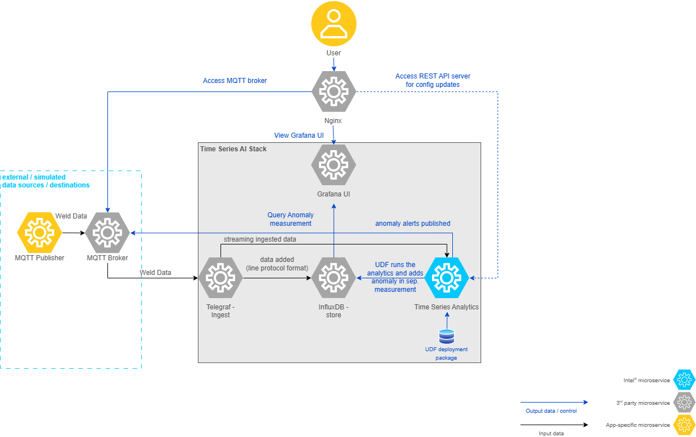

# Weld Defect Detection

<!--hide_directive

  <a class="icon_github" href="https://github.com/open-edge-platform/edge-ai-suites/tree/main/manufacturing-ai-suite/industrial-edge-insights-time-series/apps/weld-defect-detection">
     GitHub
  </a>
  

hide_directive-->

This sample app demonstrates how AI-driven analytics enable edge devices to monitor weld quality.
It detects anomalous weld patterns and alerts operators for timely intervention,
ensuring proactive maintenance, safety, and operational efficiency. No more failures
and unplanned downtime.

In this article, you can learn about the architecture of the sample and its data flow.

If you want to start working with it, instead, check out the
[Get Started Guide](../get-started.md) or [How-to Guides](../how-to-guides.md)
for Time-series applications.

## App Architecture

As seen in the following architecture diagram, the sample app at a high-level comprises of data simulators(can act as data destinations if configured) - these in the real world would be the physical devices, the generic Time Series AI stack based on **TICK Stack** comprising of Telegraf, InfluxDB, Time Series Analytics microservice using Kapacitor and Grafana.

### Data flow explanation

Let's discuss how this architecture translates to data flow in the weld anomaly detection use case, by ingesting the data using the MQTT publisher simulator and publishing the anomaly alerts to MQTT broker.

#### **Data Sources**

Simulation data in CSV format from `edge-ai-suites/manufacturing-ai-suite/industrial-edge-insights-time-series/apps/weld-defect-detection/simulation-data` is ingested into **Telegraf** using the **MQTT** protocol using the **MQTT publisher** data simulator.

#### **Data Ingestion**

**Telegraf** through its input plugins **MQTT** gathers the data and sends this input data to both **InfluxDB** and **Time Series Analytics Microservice**.

#### **Data Storage**

**InfluxDB** stores the incoming data coming from **Telegraf**.

#### **Data Processing**

**Time Series Analytics Microservice** uses the User Defined Function(UDF) deployment package(TICK Scripts, UDFs, Models) coming from the sample apps. The UDF deployment package for `Weld Defect Detection` sample app is available at `edge-ai-suites/manufacturing-ai-suite/industrial-edge-insights-time-series/apps/weld-defect-detection/time-series-analytics-config`.

Directory details is as below:

##### **`config.json`**

The `task` section defines the settings for the Kapacitor task and User-Defined Functions (UDFs).

| Key                     | Description                                                                                     | Example Value                          |
|-------------------------|-------------------------------------------------------------------------------------------------|----------------------------------------|
| `udfs`                  | Configuration for the User-Defined Functions (UDFs).                                           | See below for details.                 |

**UDFs Configuration**:

The `udfs` section specifies the details of the UDFs used in the task.

| Key     | Description                                                                                 | Example Value                          |
|---------|---------------------------------------------------------------------------------------------|----------------------------------------|
| `name`  | The name of the UDF script.                                                                 | `"weld_defect_detector.py"`       |
| `models`| The names of the model files used by the UDF.                                               | `["weld_defect_detector.pkl", "weld_defect_detector_labels.pkl", "weld_defect_detector.json"]` |

> **Note:** The maximum allowed size for `config.json` is 5 KB.
---

**Alerts Configuration**:

The `alerts` section defines the settings for alerting over MQTT protocol.

**MQTT Configuration**:

The `mqtt` section specifies the MQTT broker details for sending alerts.

| Key                 | Description                                                                 | Example Value          |
|---------------------|-----------------------------------------------------------------------------|------------------------|
| `mqtt_broker_host`  | The hostname or IP address of the MQTT broker.                              | `"ia-mqtt-broker"`     |
| `mqtt_broker_port`  | The port number of the MQTT broker.                                         | `1883`                |
| `name`              | The name of the MQTT broker configuration.                                 | `"my_mqtt_broker"`     |

##### **`udfs/`**

Contains the Python script to process the incoming data.
Uses RandomForestClassifier from scikit-learn with Intel's extension (sklearnex) to detect anomalous weld patterns in sensor data.
Supports GPU offloading on Intel GPUs via the `target_offload` configuration for accelerated inference.

> **Note:** Configure `DEVICE` environment variable (`'auto'`, `'gpu'`, or `'cpu'`) to control hardware acceleration.

##### **`tick_scripts/`**

The TICKScript `weld_defect_detector.tick` determines processing of the input data coming in.
Mainly, has the details on execution of the UDF file, storage of processed data and publishing of alerts.
By default, it is configured to publish the alerts to **MQTT**.

##### **`models/`**

Contains serialized model files:
- `weld_defect_detector.pkl`: Trained RandomForestClassifier pipeline (scikit-learn format)
- `weld_defect_detector_labels.pkl`: Label encoder for class names
- `weld_defect_detector.json`: Model metadata including feature statistics and class information for model explainability
