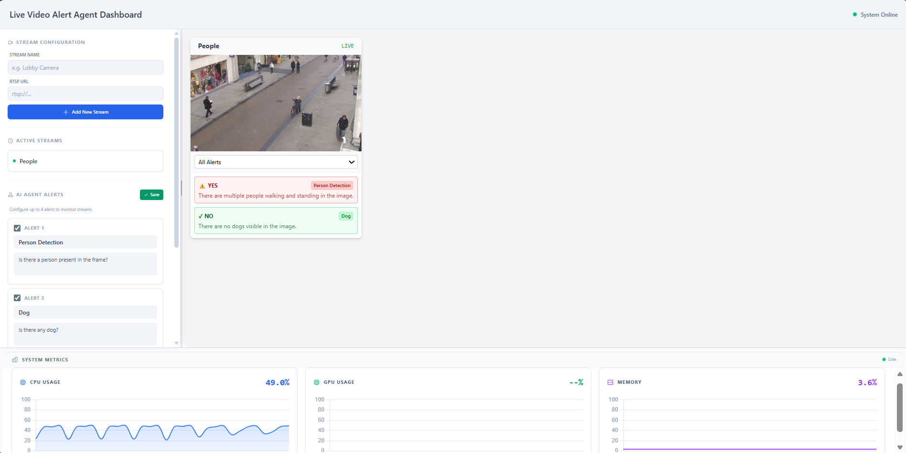
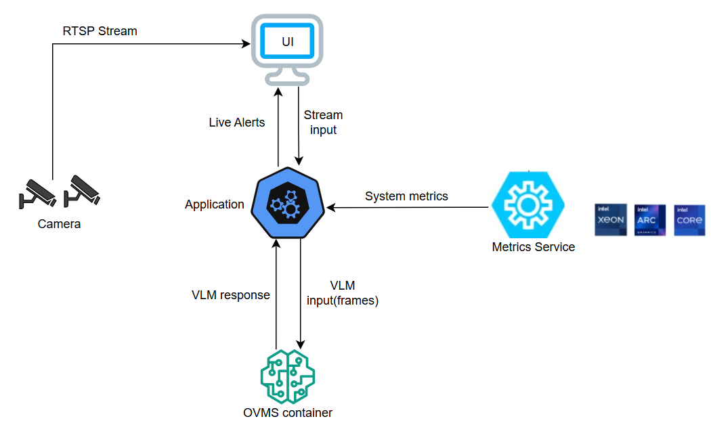

# Live Video Alert Agent

**Version: 1.0.0-rc.1**

Deploy AI-powered alerting for live video streams with OpenVINO Vision Language Models. Process RTSP streams, generate real-time alerts based on natural language prompts, and monitor them on a dashboard.



## Get Started

To see the system requirements and other installations, see the following guides:

- [System Requirements](./docs/user-guide/system-requirements.md): Check the hardware and software requirements for deploying the application.
- [Get Started](./docs/user-guide/get-started.md): Follow step-by-step instructions to set up the application.

## How It Works

The application ingests RTSP streams, performs VLM inference, and delivers real-time alerts through a web dashboard.



```
RTSP Source → StreamManager (OpenCV/Circular Buffer)
            ↓
       AgentManager (Orchestrator) ↔ VLM Service (OpenAI-compatible API)
            ↓
       EventManager (SSE Pub/Sub) → Dashboard UI
```

## Learn More

- [Get Started](docs/user-guide/get-started.md) - Quick deployment guide
- [Overview](docs/user-guide/index.md) - Features and architecture
- [System Requirements](docs/user-guide/system-requirements.md) - Hardware and software needs
- [Build from Source](docs/user-guide/how-to-build-source.md) - Custom build instructions
- [Release Notes](docs/user-guide/release-notes.md) - Changelog and known issues
- [API Reference](docs/user-guide/api-reference.md) - REST API endpoints
