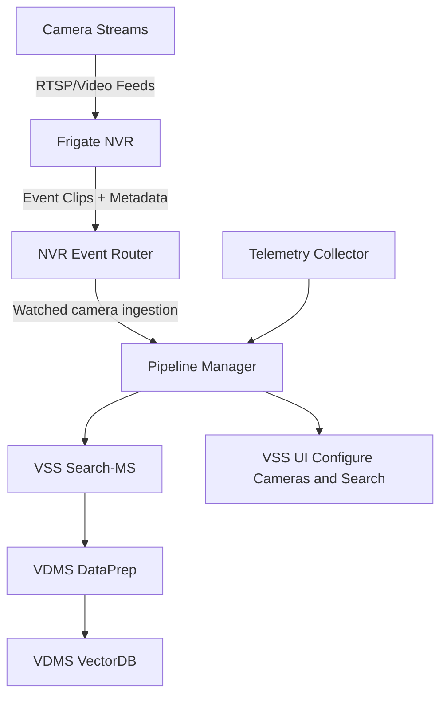

# How It Works

This document describes the end‑to‑end architecture of Live Video Search and how NVR Event Router and VSS Search integrate.

## High‑Level Architecture

## Data Flow

1. **Ingestion**: Cameras stream into Frigate, which records clips and publishes events via MQTT.
2. **Event Routing**: NVR Event Router receives events and associates clips with camera metadata.
3. **Indexing**: VSS camera configuration enables watcher-based clip ingestion to Pipeline Manager, which forwards clips to DataPrep. Embeddings are stored in VDMS.
4. **Querying**: Users query VSS UI with optional time‑range filters. Search‑MS retrieves and ranks relevant clips.
5. **Visualization**: Results are shown directly in VSS UI.
6. **Telemetry**: Collector streams system metrics to Pipeline Manager and the UI.

## Integration Points

- **Watcher-based ingestion path** ties enabled camera clips directly to VSS Search input.
- **Pipeline Manager endpoints** unify search configuration and retrieval.
- **Telemetry WS** provides live metrics for operational visibility.

## Related Architecture References

- Smart NVR architecture: [Smart NVR Overview](../../../../smart-nvr/docs/user-guide/index.md)
- VSS Search architecture: [Video Search and Summarization Docs](https://docs.openedgeplatform.intel.com/dev/edge-ai-libraries/video-search-and-summarization/how-it-works/video-search-and-summarization.html)
