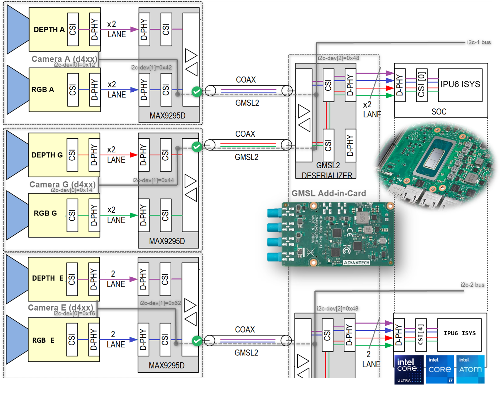
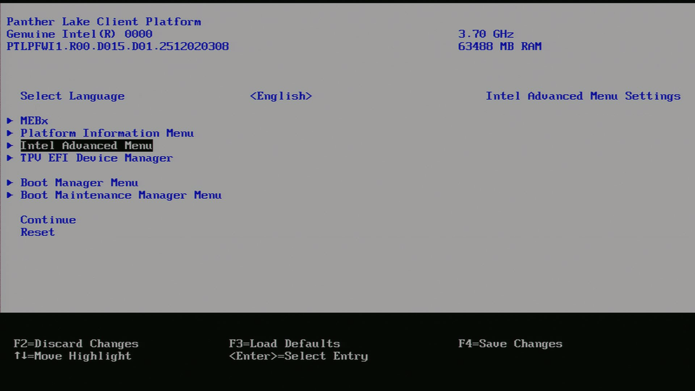
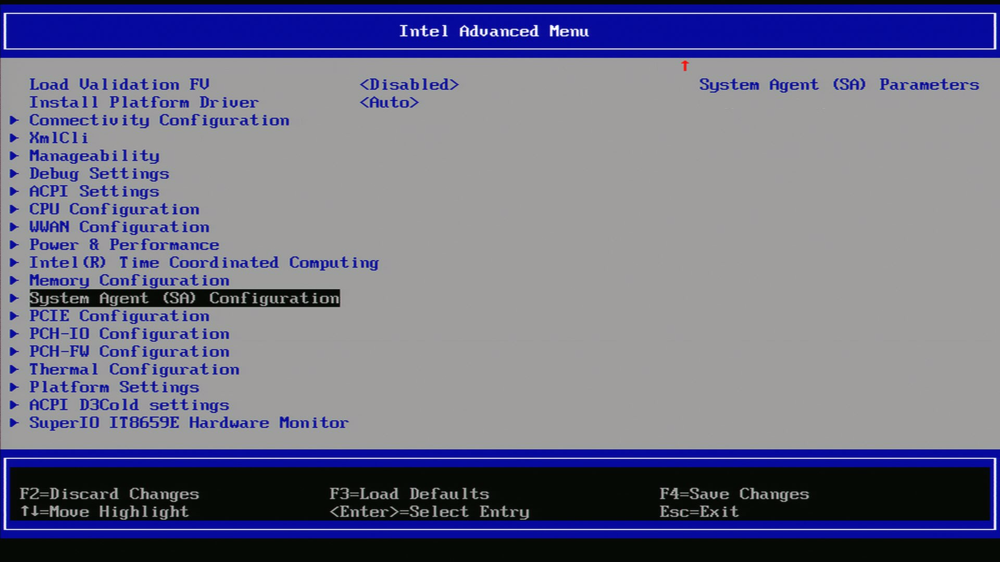
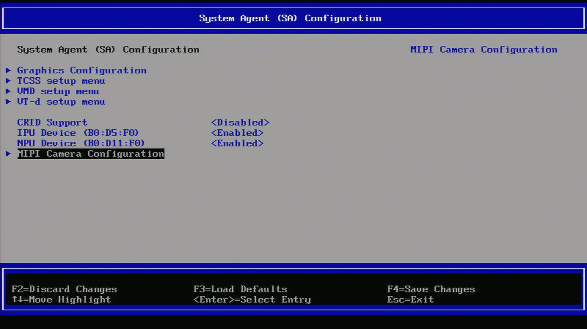
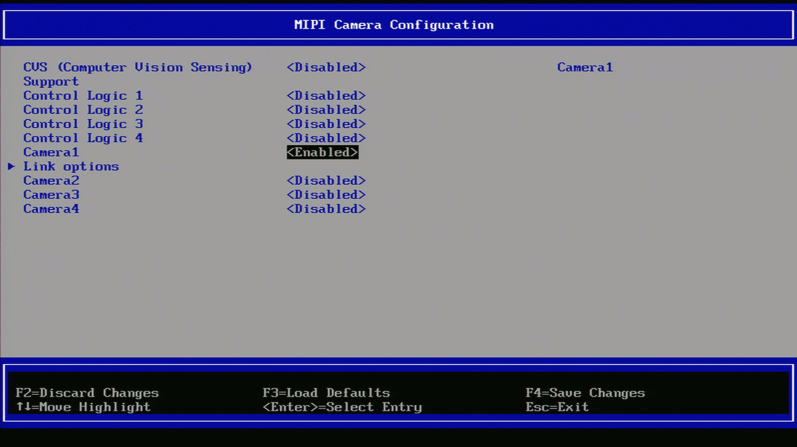

.. _gmsl-guide:

GMSL Sensor Guide
===============================

GMSL (Gigabit Multimedia Serial Link) is a high-speed serial interface designed for transmitting uncompressed video, audio, and control data over long distances. It is commonly used in automotive applications for connecting cameras and other multimedia devices to the central processing unit.

GMSL supports data rates of up to 6 Gbps, allowing for high-resolution video transmission with low latency. It uses a differential signaling method to ensure signal integrity and reduce electromagnetic interference (EMI). GMSL also includes features such as error correction and power management to enhance reliability and efficiency.

In the context of robotics and autonomous mobile robots, GMSL sensors are often used for vision-based applications, such as object detection, lane keeping, and obstacle avoidance. These sensors can provide high-quality video feeds that are essential for the perception systems of autonomous vehicles.

When integrating GMSL sensors into a robotics system, it is important to consider factors such as compatibility with the processing unit, power requirements, and the physical layout of the system. Proper configuration and calibration of GMSL sensors are also crucial to ensure optimal performance and accurate data capture.

Intel GMSL cameras uses Image Processor Unit (IPU) to process the video data captured by the camera. The IPU is responsible for tasks such as image enhancement, noise reduction, and color correction, which are essential for improving the quality of the video feed before it is used for further processing in the autonomous mobile robot's perception system.

It is crucial to understand the SerDes i2c connectivity specific to each ODM/OEM motherboards, Add-in-Cards (AIC) and GMSL2 Camera modules. Illustrated below are all details a user need to learn about I2C communication between a BDF (Bit-Definition File) Linux i2c adapter and GMSL2 i2c devices for the Intel® Core™ Ultra Series 1 and 2 (Arrow Lake-U/H) and 12th/13th/14th Gen Intel® Core™ to detect and configure GMSL capability. (see SerDes i2c mapping for further details)

.. _gmsl-overview:

Brief GMSL Add-in-Card design overview
***********************************************

A GMSL product design based |Intel| Core™ Ultra Series 1 and 2 (Arrow Lake-U/H) or 12th/13th/14th Gen |Intel| Core™ products can be illustrated as followed :

   .. figure:: ../../images/gmsl/GMSL-overview.png
      :align: center

   - The **GMSL2 Camera modules**, designed by 3rd Party GMSL2 Camera vendors, combine a Camera Sensor and GMSL2 Serializer (ex. MAX9295)
   - The **Add-in-Card (AIC)**, designed by either ODM/OEMs or 3rd Party GMSL2 Camera vendors, provide multiple GMSL2 *Derializer* (ex. MAX9296A)
   - The **|Intel|-based Motherboad**, designed by ODM/OEMs, provide Mobile Industry Processor Interface (MIPI) Camera Serial Interface (CSI) interface exposed by |Intel| Core™ Ultra Series 1 and 2 (Arrow Lake-U/H) and 12th/13th/14th Gen |Intel| Core™ products.

There are two design approaches for GMSL Add-in-Card (AIC) :

 - **Standalone-mode** `SerDes` - Single GMSL Serializer (ex. MAX9295) and Camera Sensor devices per Deserializer (e.g. MAX9296A). Such as `Axiomtek ROBOX500 4x GMSL camera interfaces <https://www.axiomtek.com/ROBOX500/>`_ Add-in-Card (AIC).

   .. figure:: ../../images/gmsl/GMSL-standalone-D457_-csi-port0.png
      :align: center

 - **Aggregated-link** `SerDes` - Dual GMSL Serializer (ex. MAX9295) and Camera Sensor devices per Deserialize (e.g. MAX9296A). Such as `Axiomtek ROBOX500 8x GMSL camera interfaces <https://www.axiomtek.com/ROBOX500/>`_ or `Advantech GMSL Input Module Card <https://www.advantech.com/en-eu/products/8d5aadd0-1ef5-4704-a9a1-504718fb3b41/mioe-gmsl/mod_fc1fc070-30f8-40c1-881f-56c967e26924>`_ , for `AFE-R360 series <https://www.advantech.com/en-eu/products/8d5aadd0-1ef5-4704-a9a1-504718fb3b41/afe-r360/mod_1e4a1980-9a31-46e6-87b6-affbd7a2cb44>`_ or `ASR-A502 series <https://www.advantech.com/en-eu/products/8d5aadd0-1ef5-4704-a9a1-504718fb3b41/asr-a502/mod_ccca0f36-a50b-40c7-87b7-10fb96448605>`_, and `SEAVO Embedded Computer HB03 <https://www.seavo.com/en/products/products-info_itemid_693.html>`_ Add-in-Cards (AIC).

   .. figure:: ../../images/gmsl/GMSL-aggregated-D457_csi-port0.png
      :align: center

 It is crucial to understand the `SerDes` i2c connectivity specific to each ODM/OEM motherboards, Add-in-Cards (AIC) and GMSL2 Camera modules. Illustrated below are all details a user need to learn about I2C communication between a BDF (Bit-Definition File) Linux i2c adapter and GMSL2 i2c devices for the |Intel| Core™ Ultra Series 1 and 2 (Arrow Lake-U/H) and 12th/13th/14th Gen |Intel| Core™ to detect and configure GMSL capability. (see :ref:`SerDes i2c mapping <gmsl-i2c-detect>` for further details)

     .. figure:: ../../images/gmsl/GMSL-overview2.png
      :align: center

More details about `Mobile Industry Processor Interface (MIPI) Camera Serial Interface (CSI) Gigabit Multimedia Serial Link (GMSL) Add-in Card (AIC) Schematic <https://cdrdv2.intel.com/v1/dl/getContent/814789?explicitVersion=true>`_ 

.. _gmsl-i2c-detect:

HOW TO detect in i2c bus to GMSL2 *Deserializer* and *Serializer* ACPI devices mapping
^^^^^^^^^^^^^^^^^^^^^^^^^^^^^^^^^^^^^^^^^^^^^^^^^^^^^^^^^^^^^^^^^^^^^^^^^^^^^^^^^^^^^^^^^^^^^^^^^^

The best way to detect i2c bus to GMSL2 *Deserializer* and *Serializer* ACPI devices mapping is by using `i2cdetect` command line tool from `i2c-tools` package on Linux OS.

.. code-block:: bash

   i2cdetect -y <i2c_bus_number>

where ``<i2c_bus_number>`` is the i2c bus number assigned to GMSL2 *Deserializer* and *Serializer* ACPI devices.

here is an example output of `i2cdetect` command line tool for GMSL2 *Deserializer* and *Serializer* ACPI devices mapping:

.. code-block:: console

  i2cdetect -r -y 0 0x20 0x6f
         0  1  2  3  4  5  6  7  8  9  a  b  c  d  e  f
    00:                                                 
    10:             -- -- -- -- -- -- 1a -- -- -- -- -- 
    20: -- -- -- -- -- -- -- 27 -- -- -- -- -- -- -- -- 
    30: -- -- -- -- -- -- -- -- -- -- -- -- -- -- -- -- 
    40: 40 -- -- -- -- -- -- -- -- -- -- -- -- -- -- -- 
    50: -- -- -- -- 54 -- -- -- -- -- -- -- 5c -- -- -- 
    60: -- -- -- -- -- -- -- -- -- -- -- -- -- -- -- -- 
    70:                                              

.. code-block:: console

  i2cdetect -r -y 1 0x20 0x6f
        0  1  2  3  4  5  6  7  8  9  a  b  c  d  e  f
    00:                                                 
    10:             -- -- -- -- -- -- -- -- -- -- -- -- 
    20: -- -- -- -- -- -- -- -- -- -- -- -- -- -- -- -- 
    30: -- -- -- -- -- -- -- -- -- -- -- -- -- -- -- -- 
    40: -- -- -- -- -- -- -- -- -- -- -- -- -- -- -- -- 
    50: -- -- -- -- -- -- -- -- -- -- -- -- -- -- -- -- 
    60: -- -- -- -- -- -- -- -- -- -- -- -- -- -- -- -- 
    70:    

As you can see my devices are on ITC i2c bus 0 with address 0x1a, 0x27, 0x40 and 0x54, which are corresponding to GMSL2 *Deserializer* and *Serializer* ACPI devices configured on my system.

.. _gmsl-driver:

GMSL2 Driver
^^^^^^^^^^^^^

Prerequisite for gmsl driver can be found on ECI apt repo:

follow the guide in ref:`Set up ECI APT Repository <set-up-eci-apt-repository>`:

Once ECI APT repository is set up, you can install gmsl driver by running the following command:

.. code-block:: bash

   sudo apt-get update
   sudo apt-get install intel-mipi-gmsl-dkms

Select max929x or max967xx deserializer to compile certain linux v4l2 i2c sensors driver with.

.. _gmsl-enable-serdes:

Reboot the system and enter into the BIOS/UEFI settings. Navigate to the ACPI configuration section and verify that the GMSL SerDes device is listed and enabled. If it is not present, you may need to update your system firmware or consult your hardware vendor for support.

Go into UEFI Advanced setting.

Navigate to System Agent (SA)

Navigate to MIPI Configuration

Ensure GMSL SerDes is enabled.

After enabling the GMSL SerDes device in the UEFI settings, click on 'link options' to adjust the settings for the GMSL SerDes link.

Boot the system into the OS

.. _gmsl-acpidev:

Configure |Intel| GMSL `SerDes` ACPI devices
***********************************************

To enable multiple GMSL Cameras for same or different vendors, user need define MIPI Cameras ACPI device from UEFI/BIOS settings. 

#. Review |Intel| enabled GMSL2 camera module with its corresponding ACPI devices custom HID:

   +--------------+----------------------+-----------------------+------------+------------------+----------------------------------------------------------------------------------------------------------------------------------------+
   | ACPI         | ACPI                 |  Sensor Type          | GMSL2      | Max Resolution   | Vendor URL                                                                                                                             |
   | custom HID   | Camera module label  |                       | Serializer |                  |                                                                                                                                        |
   +==============+======================+=======================+============+==================+========================================================================================================================================+
   | ``INTC10CD`` | ``d4xx``             | OV9782 + D450 Depth   | MAX9295    | 2x (1280x720)    | `Intel RealSense™ Depth Camera D457 <https://realsenseai.com/products/d457-gmsl-fakra>`_                                               |
   +--------------+----------------------+-----------------------+------------+------------------+----------------------------------------------------------------------------------------------------------------------------------------+
   | ``D3000004`` | ``D3CMCXXX-115-084`` | ISX031                | MAX9295    | 1920x1536        | `D3 Embedded® <https://www.d3embedded.com/>`_                                                                                          |
   +--------------+----------------------+-----------------------+------------+------------------+ sensor Linux drivers package available upon sales@d3embedded.com camera purchase                                                       |
   | ``D3000005`` | ``D3CMCXXX-106-084`` | IMX390                | MAX9295    | 1920x1080        |                                                                                                                                        |
   +--------------+----------------------+-----------------------+------------+------------------+                                                                                                                                        |
   | ``D3000006`` | ``D3CMCXXX-089-084`` | AR0234                | MAX9295    | 1280x960         |                                                                                                                                        |
   +--------------+----------------------+-----------------------+------------+------------------+----------------------------------------------------------------------------------------------------------------------------------------+
   | ``OTOC1031`` | ``otocam``           | ISX031                | MAX9295    | 1920x1536        | `oToBrite® <https://www.otobrite.com/>`_                                                                                               |
   +--------------+----------------------+-----------------------+------------+------------------+ sensor Linux drivers package available upon sales@otobrite.com camera purchase                                                         |
   | ``OTOC1021`` | ``otocam``           | ISX021                | MAX9295    | 1920x1280        |                                                                                                                                        |
   +--------------+----------------------+-----------------------+------------+------------------+----------------------------------------------------------------------------------------------------------------------------------------+

#. Review the :ref:`gmsl-overview`, if not already done.

   Please refer to each tabs below to understand ODM hardware distinct ACPI Camera device configuration table : 

   .. tabs::

      .. group-tab:: Advantech® AFE-R360 & ASR-A502 series

         The `Advantech GMSL Input Module Card <https://www.advantech.com/en-eu/products/8d5aadd0-1ef5-4704-a9a1-504718fb3b41/mioe-gmsl/mod_fc1fc070-30f8-40c1-881f-56c967e26924>`_ for `AFE-R360 series <https://www.advantech.com/en-eu/products/8d5aadd0-1ef5-4704-a9a1-504718fb3b41/afe-r360/mod_1e4a1980-9a31-46e6-87b6-affbd7a2cb44>`_ and `ASR-A502 series <https://www.advantech.com/en-eu/products/8d5aadd0-1ef5-4704-a9a1-504718fb3b41/asr-a502/mod_ccca0f36-a50b-40c7-87b7-10fb96448605>`_ may provide up to 6x GMSL camera interface (FAKRA universal type).

         .. tabs::

            .. group-tab:: RealSense™ D457

               Below an ACPI devices configure example for GMSL2 |Intel| RealSense™ Depth Camera D457 :

               .. list-table:: *Aggregated-link* `SerDes` CSI-2 port 0 and 4 and I2C settings for GMSL Add-in-Card (AIC)
                  :widths: 25 15 15 15 15 
                  :header-rows: 1

                  *  - UEFI Custom Sensor
                     - Camera 1
                     - Camera 2
                     - Camera 3
                     - Camera 4
                  *  - GMSL Camera suffix
                     - a
                     - g
                     - e
                     - k
                  *  - Custom HID
                     - ``INTC10CD``
                     - ``INTC10CD``
                     - ``INTC10CD``
                     - ``INTC10CD``
                  *  - PPR Value
                     - 2
                     - 2
                     - 2
                     - 2
                  *  - PPR Unit
                     - 1
                     - 1
                     - 1
                     - 1
                  *  - Camera module label
                     - ``d4xx``
                     - ``d4xx``
                     - ``d4xx``
                     - ``d4xx``
                  *  - MIPI Port (Index)
                     - 0
                     - 0
                     - 4
                     - 4
                  *  - LaneUsed
                     - x2
                     - x2
                     - x2
                     - x2
                  *  - Number of I2C
                     - 3
                     - 3
                     - 3
                     - 3
                  *  - I2C Channel
                     - I2C1
                     - I2C1
                     - I2C2
                     - I2C2
                  *  - Device0 I2C Address
                     - 12
                     - 14
                     - 12
                     - 14
                  *  - Device1 I2C Address
                     - 42
                     - 44
                     - 42
                     - 44
                  *  - Device2 I2C Address
                     - 48
                     - 48
                     - 48
                     - 48

            .. group-tab:: D3CMCXXX-115-084

               Below an ACPI devices configure example for `D3 Embedded Discovery <https://www.d3embedded.com/product/isx031-smart-camera-narrow-fov-gmsl2-unsealed/>`_ GMSL2 Camera module :

               .. list-table:: *Aggregated-link* `SerDes` CSI-2 port 0 and 4 and I2C settings for GMSL Add-in-Card (AIC)
                  :widths: 25 15 15
                  :header-rows: 1

                  *  - UEFI Custom Sensor
                     - Camera 1
                     - Camera 2
                  *  - GMSL Camera suffix
                     - a
                     - e
                  *  - Custom HID
                     - ``D3000004``
                     - ``D3000004``
                  *  - PPR Value
                     - 2
                     - 2
                  *  - PPR Unit
                     - 2
                     - 2
                  *  - Camera module label
                     - ``D3CMCXXX-115-084``
                     - ``D3CMCXXX-115-084``
                  *  - MIPI Port (Index)
                     - 0
                     - 4
                  *  - LaneUsed
                     - x2
                     - x2
                  *  - Number of I2C
                     - 3
                     - 3
                  *  - I2C Channel
                     - I2C1
                     - I2C2
                  *  - Device0 I2C Address
                     - 48
                     - 48
                  *  - Device1 I2C Address
                     - 42
                     - 44
                  *  - Device2 I2C Address
                     - 10
                     - 12

               .. attention::
                  
                  please note, on Advantech® AFE-R360 series the four D3CMCXXX ACPI configuration achieved by ``PPR Unit=2`` also requires setting ``Device0`` for GMSL2 **Aggregated-link** Deserializer I2C address (e.g. MAX9296A) and ``Device2`` for Sensors I2C address (e.g. ISX031). 

            .. group-tab:: D3CMCXXX-106-084

               Below an ACPI devices configure example for `D3 Embedded Discovery PRO <https://www.d3embedded.com/product/imx390-medium-fov-gmsl2-sealed/>`_ GMSL2 Camera module :

               .. list-table:: *Aggregated-link* `SerDes` CSI-2 port 0 and 4 and I2C settings for GMSL Add-in-Card (AIC)
                  :widths: 25 15 15
                  :header-rows: 1

                  *  - UEFI Custom Sensor
                     - Camera 1
                     - Camera 2
                  *  - GMSL Camera suffix
                     - a
                     - e
                  *  - Custom HID
                     - ``D3000005``
                     - ``D3000005``
                  *  - PPR Value
                     - 2
                     - 2
                  *  - PPR Unit
                     - 2
                     - 2
                  *  - Camera module label
                     - ``D3CMCXXX-106-084``
                     - ``D3CMCXXX-106-084``
                  *  - MIPI Port (Index)
                     - 0
                     - 4
                  *  - LaneUsed
                     - x2
                     - x2
                  *  - Number of I2C
                     - 3
                     - 3
                  *  - I2C Channel
                     - I2C1
                     - I2C2
                  *  - Device0 I2C Address
                     - 48
                     - 48
                  *  - Device1 I2C Address
                     - 42
                     - 44
                  *  - Device2 I2C Address
                     - 10
                     - 12

               .. attention::
                  
                  please note, on Advantech® AFE-R360 series the four D3CMCXXX ACPI configuration achieved by ``PPR Unit=2`` also requires setting ``Device0`` for GMSL2 **Aggregated-link** Deserializer I2C address (e.g. MAX9296A) and ``Device2`` for Sensors I2C address (e.g. ISX031). 

            .. group-tab:: oToCAM222

               Below an ACPI devices configure example for `oToBrite® oToCAM222 <https://www.otobrite.com/product/automotive-camera/isx021_gmsl2_otocam222-s195m>`_ GMSL2 camera modules :

               .. list-table:: *Aggregated-link* `SerDes` CSI-2 port 0 and 4 and I2C settings for GMSL Add-in-Card (AIC)
                  :widths: 25 15 15 15 15 
                  :header-rows: 1

                  *  - UEFI Custom Sensor
                     - Camera 1
                     - Camera 2
                     - Camera 3
                     - Camera 4
                  *  - GMSL Camera suffix
                     - a
                     - g
                     - e
                     - k
                  *  - Custom HID
                     - ``OTOC1021``
                     - ``OTOC1021``
                     - ``OTOC1021``
                     - ``OTOC1021``
                  *  - PPR Value
                     - 2
                     - 2
                     - 2
                     - 2
                  *  - PPR Unit
                     - 1
                     - 1
                     - 1
                     - 1
                  *  - Camera module label
                     - ``otocam``
                     - ``otocam``
                     - ``otocam``
                     - ``otocam``
                  *  - MIPI Port (Index)
                     - 0
                     - 0
                     - 4
                     - 4
                  *  - LaneUsed
                     - x2
                     - x2
                     - x2
                     - x2
                  *  - Number of I2C
                     - 3
                     - 3
                     - 3
                     - 3
                  *  - I2C Channel
                     - I2C1
                     - I2C1
                     - I2C2
                     - I2C2
                  *  - Device0 I2C Address
                     - 10
                     - 11
                     - 10
                     - 11
                  *  - Device1 I2C Address
                     - 18
                     - 19
                     - 18
                     - 19
                  *  - Device2 I2C Address
                     - 48
                     - 48
                     - 48
                     - 48

            .. group-tab:: oToCAM223

               Below an ACPI devices configure example for `oToBrite® oToCAM223 <https://www.otobrite.com/product/automotive-camera/isx031_gmsl2_otocam223-s195m>`_ GMSL2 camera modules :

               .. list-table:: *Aggregated-link* `SerDes` CSI-2 port 0 and 4 and I2C settings for GMSL Add-in-Card (AIC)
                  :widths: 25 15 15 15 15 
                  :header-rows: 1

                  *  - UEFI Custom Sensor
                     - Camera 1
                     - Camera 2
                     - Camera 3
                     - Camera 4
                  *  - GMSL Camera suffix
                     - a
                     - g
                     - e
                     - k
                  *  - Custom HID
                     - ``OTOC1031``
                     - ``OTOC1031``
                     - ``OTOC1031``
                     - ``OTOC1031``
                  *  - PPR Value
                     - 2
                     - 2
                     - 2
                     - 2
                  *  - PPR Unit
                     - 1
                     - 1
                     - 1
                     - 1
                  *  - Camera module label
                     - ``otocam``
                     - ``otocam``
                     - ``otocam``
                     - ``otocam``
                  *  - MIPI Port (Index)
                     - 0
                     - 0
                     - 4
                     - 4
                  *  - LaneUsed
                     - x2
                     - x2
                     - x2
                     - x2
                  *  - Number of I2C
                     - 3
                     - 3
                     - 3
                     - 3
                  *  - I2C Channel
                     - I2C1
                     - I2C1
                     - I2C2
                     - I2C2
                  *  - Device0 I2C Address
                     - 10
                     - 11
                     - 10
                     - 11
                  *  - Device1 I2C Address
                     - 18
                     - 19
                     - 18
                     - 19
                  *  - Device2 I2C Address
                     - 48
                     - 48
                     - 48
                     - 48

         .. figure:: ../../images/gmsl/gmsl-adv-mioe.png
               :align: left
               :figwidth: 110%

         Another example below illustrates how to configure ACPI devices 6x |Intel| RealSense™ Depth Camera D457 GMSL2 module : 

         .. list-table:: *Aggregated-link* `SerDes` CSI-2 port 0, 4 and 5 and I2C settings for GMSL Add-in-Card (AIC)
            :widths: 25 15 15 15 15 15 15 
            :header-rows: 1

            *  - UEFI Custom Sensor
               - Camera 1
               - Camera 2
               - Camera 3
               - Camera 4
               - *Camera 5* or N/A :sup:`1`
               - *Camera 6* or N/A :sup:`1`
            *  - GMSL Camera suffix
               - a
               - g
               - e
               - f
               - *k*
               - *l*
            *  - Custom HID
               - ``INTC10CD``
               - ``INTC10CD``
               - ``INTC10CD``
               - ``INTC10CD``
               - ``INTC10CD``
               - ``INTC10CD``
            *  - PPR Value
               - 2
               - 2
               - 2
               - 2
               - 2
               - 2
            *  - PPR Unit
               - 1
               - 1
               - 1
               - 1
               - 1
               - 1
            *  - Camera module label
               - ``d4xx``
               - ``d4xx``
               - ``d4xx``
               - ``d4xx``
               - ``d4xx``
               - ``d4xx``
            *  - MIPI Port (Index)
               - 0
               - 0
               - 4
               - 5
               - 4
               - 5
            *  - LaneUsed
               - x2
               - x2
               - x2
               - x2
               - x2
               - x2
            *  - Number of I2C
               - 3
               - 3
               - 3
               - 3
               - 3
               - 3
            *  - I2C Channel
               - I2C1
               - I2C1
               - I2C2
               - I2C2
               - *I2C2*
               - *I2C2*
            *  - Device0 I2C Address
               - 12
               - 14
               - 16
               - 18
               - *12*
               - *14*
            *  - Device1 I2C Address
               - 42
               - 44
               - 62
               - 42
               - *64*
               - *44*
            *  - Device2 I2C Address
               - 48
               - 48
               - 48
               - 4a
               - *48*
               - *4a*

         .. attention::
            
            For the time being each GMSL2 **Aggregated-link** Deserializer (e.g. MAX9296A) on the same I2C Channel shall set identical *Custom HID* and *Camera module label* tuple matching with GMSL2 Serializer and Camera Sensor devices type.

            The `Advantech GMSL Input Module Card <https://www.advantech.com/en-eu/products/8d5aadd0-1ef5-4704-a9a1-504718fb3b41/mioe-gmsl/mod_fc1fc070-30f8-40c1-881f-56c967e26924>`_ for `AFE-R360 series <https://www.advantech.com/en-eu/products/8d5aadd0-1ef5-4704-a9a1-504718fb3b41/afe-r360/mod_1e4a1980-9a31-46e6-87b6-affbd7a2cb44>`_ I2C1 Channel (ex. ``INTC10CD``) **Aggregated-link** Deserializer (e.g. MAX9296A) i2c device `0x48` shall set *Custom HID* (ex. ``INTC10CD``) and *Camera module label* (ex ``d4xx``) tuple for both *GMSL Camera suffix* `a` and `g`, where the other  **Aggregated-link** Deserializer (e.g. MAX9296A) i2c device `0x4a` could have a different *Custom HID* (ex ``INTC1031``) and *Camera module* label (ex ``isx031``) tuple on both GMSL Camera suffix `e` and `k`.

      .. group-tab:: SEAVO® HB03

         The `SEAVO® Embedded Computer HB03 <https://www.seavo.com/en/products/products-info_itemid_693.html>`_ UEFI BIOS ``Version: S1132C1133A11`` allow admin user to configure up to 4x GMSL2 camera interface (FAKRA universal type).

         .. tabs::

            .. group-tab:: RealSense™ D457

               Below an ACPI devices configure example for GMSL2 |Intel| RealSense™ Depth Camera D457 :

               .. list-table:: *Aggregated-link* `SerDes` CSI-2 port 0 and 4 and I2C settings for GMSL Add-in-Card (AIC)
                  :widths: 25 15 15 15 15 
                  :header-rows: 1

                  *  - UEFI Custom Sensor
                     - Camera 1
                     - Camera 2
                     - Camera 3
                     - Camera 4
                  *  - GMSL Camera suffix
                     - a
                     - g
                     - e
                     - k
                  *  - Custom HID
                     - ``INTC10CD``
                     - ``INTC10CD``
                     - ``INTC10CD``
                     - ``INTC10CD``
                  *  - PPR Value
                     - 2
                     - 2
                     - 2
                     - 2
                  *  - PPR Unit
                     - 1
                     - 1
                     - 1
                     - 1
                  *  - Camera module label
                     - ``d4xx``
                     - ``d4xx``
                     - ``d4xx``
                     - ``d4xx``
                  *  - MIPI Port (Index)
                     - 0
                     - 0
                     - 4
                     - 4
                  *  - LaneUsed
                     - x4
                     - x4
                     - x4
                     - x4
                  *  - Number of I2C
                     - 3
                     - 3
                     - 3
                     - 3
                  *  - I2C Channel
                     - I2C1
                     - I2C1
                     - I2C0
                     - I2C0
                  *  - Device0 I2C Address
                     - 12
                     - 14
                     - 12
                     - 14
                  *  - Device1 I2C Address
                     - 42
                     - 44
                     - 42
                     - 44
                  *  - Device2 I2C Address
                     - 48
                     - 48
                     - 48
                     - 48

            .. group-tab:: D3CMCXXX-115-084

               Below an ACPI devices configure example for `D3 Embedded Discovery <https://www.d3embedded.com/product/isx031-smart-camera-narrow-fov-gmsl2-unsealed/>`_ GMSL2 Camera module :

               .. list-table:: *Aggregated-link* `SerDes` CSI-2 port 0 and 4 and I2C settings for GMSL Add-in-Card (AIC)
                  :widths: 25 15 15
                  :header-rows: 1

                  *  - UEFI Custom Sensor
                     - Camera 1
                     - Camera 2
                  *  - GMSL Camera suffix
                     - a
                     - e
                  *  - Custom HID
                     - ``D3000004``
                     - ``D3000004``
                  *  - PPR Value
                     - 2
                     - 2
                  *  - PPR Unit
                     - 2
                     - 2
                  *  - Camera module label
                     - ``D3CMCXXX-115-084``
                     - ``D3CMCXXX-115-084``
                  *  - MIPI Port (Index)
                     - 0
                     - 4
                  *  - LaneUsed
                     - x4
                     - x4
                  *  - Number of I2C
                     - 3
                     - 3
                  *  - I2C Channel
                     - I2C1
                     - I2C0
                  *  - Device0 I2C Address
                     - 48
                     - 48
                  *  - Device1 I2C Address
                     - 42
                     - 44
                  *  - Device2 I2C Address
                     - 10
                     - 12

               .. attention::
                  
                  please note, on Seavo® HB03 the four D3CMCXXX ACPI configuration achieved by ``PPR Unit=2`` also requires setting ``Device0`` for GMSL2 **Aggregated-link** Deserializer I2C address (e.g. MAX9296A) and ``Device2`` for Sensors I2C address (e.g. ISX031). 

            .. group-tab:: D3CMCXXX-106-084

               Below an ACPI devices configure example for `D3 Embedded Discovery PRO <https://www.d3embedded.com/product/imx390-medium-fov-gmsl2-sealed/>`_ GMSL2 Camera module :

               .. list-table:: *Aggregated-link* `SerDes` CSI-2 port 0 and 4 and I2C settings for GMSL Add-in-Card (AIC)
                  :widths: 25 15 15
                  :header-rows: 1

                  *  - UEFI Custom Sensor
                     - Camera 1
                     - Camera 2
                  *  - GMSL Camera suffix
                     - a
                     - e
                  *  - Custom HID
                     - ``D3000005``
                     - ``D3000005``
                  *  - PPR Value
                     - 2
                     - 2
                  *  - PPR Unit
                     - 2
                     - 2
                  *  - Camera module label
                     - ``D3CMCXXX-106-084``
                     - ``D3CMCXXX-106-084``
                  *  - MIPI Port (Index)
                     - 0
                     - 4
                  *  - LaneUsed
                     - x4
                     - x4
                  *  - Number of I2C
                     - 3
                     - 3
                  *  - I2C Channel
                     - I2C1
                     - I2C0
                  *  - Device0 I2C Address
                     - 48
                     - 48
                  *  - Device1 I2C Address
                     - 42
                     - 44
                  *  - Device2 I2C Address
                     - 10
                     - 12

               .. attention::
                  
                  please note, on Seavo® HB03 four D3CMCXXX ACPI configuration achieved by ``PPR Unit=2`` also requires setting ``Device0`` for GMSL2 **Aggregated-link** Deserializer I2C address (e.g. MAX9296A) and ``Device2`` for Sensors I2C address (e.g. ISX031). 

            .. group-tab:: oToCAM222

               Below an ACPI devices configure example for `oToBrite® oToCAM222 <https://www.otobrite.com/product/automotive-camera/isx021_gmsl2_otocam222-s195m>`_ GMSL2 camera modules :

               .. list-table:: *Aggregated-link* `SerDes` CSI-2 port 0 and 4 and I2C settings for GMSL Add-in-Card (AIC)
                  :widths: 25 15 15 15 15 
                  :header-rows: 1

                  *  - UEFI Custom Sensor
                     - Camera 1
                     - Camera 2
                     - Camera 3
                     - Camera 4
                  *  - GMSL Camera suffix
                     - a
                     - g
                     - e
                     - k
                  *  - Custom HID
                     - ``OTOC1021``
                     - ``OTOC1021``
                     - ``OTOC1021``
                     - ``OTOC1021``
                  *  - PPR Value
                     - 2
                     - 2
                     - 2
                     - 2
                  *  - PPR Unit
                     - 1
                     - 1
                     - 1
                     - 1
                  *  - Camera module label
                     - ``otocam``
                     - ``otocam``
                     - ``otocam``
                     - ``otocam``
                  *  - MIPI Port (Index)
                     - 0
                     - 0
                     - 4
                     - 4
                  *  - LaneUsed
                     - x4
                     - x4
                     - x4
                     - x4
                  *  - Number of I2C
                     - 3
                     - 3
                     - 3
                     - 3
                  *  - I2C Channel
                     - I2C1
                     - I2C1
                     - I2C0
                     - I2C0
                  *  - Device0 I2C Address
                     - 10
                     - 11
                     - 10
                     - 11
                  *  - Device1 I2C Address
                     - 18
                     - 19
                     - 18
                     - 19
                  *  - Device2 I2C Address
                     - 48
                     - 48
                     - 48
                     - 48

            .. group-tab:: oToCAM223

               Below an ACPI devices configure example for `oToBrite® oToCAM223 <https://www.otobrite.com/product/automotive-camera/isx031_gmsl2_otocam223-s195m>`_ GMSL2 camera modules :

               .. list-table:: *Aggregated-link* `SerDes` CSI-2 port 0 and 4 and I2C settings for GMSL Add-in-Card (AIC)
                  :widths: 25 15 15 15 15 
                  :header-rows: 1

                  *  - UEFI Custom Sensor
                     - Camera 1
                     - Camera 2
                     - Camera 3
                     - Camera 4
                  *  - GMSL Camera suffix
                     - a
                     - g
                     - e
                     - k
                  *  - Custom HID
                     - ``OTOC1031``
                     - ``OTOC1031``
                     - ``OTOC1031``
                     - ``OTOC1031``
                  *  - PPR Value
                     - 2
                     - 2
                     - 2
                     - 2
                  *  - PPR Unit
                     - 1
                     - 1
                     - 1
                     - 1
                  *  - Camera module label
                     - ``otocam``
                     - ``otocam``
                     - ``otocam``
                     - ``otocam``
                  *  - MIPI Port (Index)
                     - 0
                     - 0
                     - 4
                     - 4
                  *  - LaneUsed
                     - x4
                     - x4
                     - x4
                     - x4
                  *  - Number of I2C
                     - 3
                     - 3
                     - 3
                     - 3
                  *  - I2C Channel
                     - I2C1
                     - I2C1
                     - I2C0
                     - I2C0
                  *  - Device0 I2C Address
                     - 10
                     - 11
                     - 10
                     - 11
                  *  - Device1 I2C Address
                     - 18
                     - 19
                     - 18
                     - 19
                  *  - Device2 I2C Address
                     - 48
                     - 48
                     - 48
                     - 48

         .. note:: 

            please note, GMSL2 *Aggregated-link* `SerDes` CSI-2 port 0 and 4 is purposely set to ``LaneUsed = x4`` to improve |Intel| IPU6 DPHY signal-integrity problem on `SEAVO® Embedded Computer HB03 <https://www.seavo.com/en/products/products-info_itemid_693.html>`_ .

         .. figure:: ../../images/gmsl/gmsl-seavo-hb03.png
            :align: left
            :figwidth: 80%
      
         .. attention::
            
            For the time being each GMSL2 **Aggregated-link** Deserializer (e.g. MAX9296A) on the same I2C Channel shall set identical *Custom HID* and *Camera module label* tuple matching with GMSL2 Serializer and Camera Sensor devices type.

            The `SEAVO® Embedded Computer HB03 <https://www.seavo.com/en/products/products-info_itemid_693.html>`_ Add-in-Cards (AIC) I2C1 Channel  (ex. ``INTC10CD``) **Aggregated-link** Deserializer (e.g. MAX9296A) i2c device `0x48` shall set *Custom HID* (ex. ``INTC10CD``) and *Camera module label* (ex ``d4xx``) tuple for both *GMSL Camera suffix* `a` and `g`, where the other  **Aggregated-link** Deserializer (e.g. MAX9296A) i2c device `0x4a` could have a different *Custom HID* (ex ``INTC1031``) and *Camera module* label (ex ``isx031``) tuple on both GMSL Camera suffix `e` and `k`.

      .. group-tab:: Axiomtek® ROBOX500

         The `Axiomtek ROBOX500 <https://www.axiomtek.com/ROBOX500/>`_ may provide either 4x GMSL or 8x GMSL camera interface (FAKRA universal type).

         .. tabs::

            .. group-tab:: RealSense™ D457

               Below an ACPI devices configure example for  4x |Intel| RealSense™ Depth Camera D457 GMSL2 module :

               .. list-table:: Standalone-link `SerDes` CSI-2 port 0, 1, 2 and 3 and I2C settings for GMSL Add-in-Card (AIC)
                  :widths: 25 15 15 15 15
                  :header-rows: 1

                  *  - UEFI Custom Sensor
                     - Camera 1
                     - Camera 2
                     - Camera 3
                     - Camera 4
                  *  - Camera suffix
                     - a
                     - b
                     - c
                     - d
                  *  - Custom HID
                     - ``INTC10CD``
                     - ``INTC10CD``
                     - ``INTC10CD``
                     - ``INTC10CD``
                  *  - PPR Value
                     - 2
                     - 2
                     - 2
                     - 2
                  *  - PPR Unit
                     - 1
                     - 1
                     - 1
                     - 1
                  *  - Camera module label
                     - ``d4xx``
                     - ``d4xx``
                     - ``d4xx``
                     - ``d4xx``
                  *  - MIPI Port (Index)
                     - 0
                     - 1
                     - 2
                     - 3
                  *  - LaneUsed
                     - x2
                     - x2
                     - x2
                     - x2
                  *  - Number of I2C
                     - 3
                     - 3
                     - 3
                     - 3
                  *  - I2C Channel
                     - I2C5
                     - I2C5
                     - I2C5
                     - I2C5
                  *  - Device0 I2C Address
                     - 12
                     - 14
                     - 16
                     - 18
                  *  - Device1 I2C Address
                     - 42
                     - 44
                     - 62
                     - 64
                  *  - Device2 I2C Address
                     - 48
                     - 4a
                     - 68
                     - 6c

            .. group-tab:: D3CMCXXX-115-084

               Below an ACPI devices configure example of four GMSL2 Camera module from `D3 Embedded Discovery <https://www.d3embedded.com/product/isx031-smart-camera-narrow-fov-gmsl2-unsealed/>`_:

               .. list-table:: *Aggregated-link* `SerDes` CSI-2 port 0 and 4 and I2C settings for GMSL Add-in-Card (AIC)
                  :widths: 25 15 15 15 15
                  :header-rows: 1

                  *  - UEFI Custom Sensor
                     - Camera 1
                     - Camera 2
                     - Camera 3
                     - Camera 4
                  *  - Camera suffix
                     - a
                     - b
                     - c
                     - d
                  *  - Custom HID
                     - ``D3000004``
                     - ``D3000004``
                     - ``D3000004``
                     - ``D3000004``
                  *  - PPR Value
                     - 2
                     - 2
                     - 2
                     - 2
                  *  - PPR Unit
                     - 1
                     - 1
                     - 1
                     - 1
                  *  - Camera module label
                     - ``D3CMCXXX-115-084``
                     - ``D3CMCXXX-115-084``
                     - ``D3CMCXXX-115-084``
                     - ``D3CMCXXX-115-084``
                  *  - MIPI Port (Index)
                     - 0
                     - 1
                     - 2
                     - 3
                  *  - LaneUsed
                     - x2
                     - x2
                     - x2
                     - x2
                  *  - Number of I2C
                     - 3
                     - 3
                     - 3
                     - 3
                  *  - I2C Channel
                     - I2C5
                     - I2C5
                     - I2C5
                     - I2C5
                  *  - Device0 I2C Address
                     - 48
                     - 4a
                     - 68
                     - 6c
                  *  - Device1 I2C Address
                     - 42
                     - 44
                     - 62
                     - 64
                  *  - Device2 I2C Address
                     - 12
                     - 14
                     - 16
                     - 18

               .. attention::
                  
                  please note, on the *Axiomtek® ROBOX500* the 4x D3CMCXXX Camera ACPI configuration is achieved by ``PPR Unit=1`` requires setting ``Device0`` for GMSL2 **Aggregated-link** Deserializer I2C address (e.g. MAX9296A) and ``Device2`` for Sensors I2C address (e.g. ISX031). 

            .. group-tab:: D3CMCXXX-106-084

               Below an ACPI devices configure example of four GMSL2 Camera module from `D3 Embedded Discovery PRO <https://www.d3embedded.com/product/imx390-medium-fov-gmsl2-sealed/>`_ :

               .. list-table:: *Aggregated-link* `SerDes` CSI-2 port 0 and 4 and I2C settings for GMSL Add-in-Card (AIC)
                  :widths: 25 15 15 15 15
                  :header-rows: 1

                  *  - UEFI Custom Sensor
                     - Camera 1
                     - Camera 2
                     - Camera 3
                     - Camera 4
                  *  - Camera suffix
                     - a
                     - b
                     - c
                     - d
                  *  - Custom HID
                     - ``D3000005``
                     - ``D3000005``
                     - ``D3000005``
                     - ``D3000005``
                  *  - PPR Value
                     - 2
                     - 2
                     - 2
                     - 2
                  *  - PPR Unit
                     - 1
                     - 1
                     - 1
                     - 1
                  *  - Camera module label
                     - ``D3CMCXXX-106-084``
                     - ``D3CMCXXX-106-084``
                     - ``D3CMCXXX-106-084``
                     - ``D3CMCXXX-106-084``
                  *  - MIPI Port (Index)
                     - 0
                     - 1
                     - 2
                     - 3
                  *  - LaneUsed
                     - x2
                     - x2
                     - x2
                     - x2
                  *  - Number of I2C
                     - 3
                     - 3
                     - 3
                     - 3
                  *  - I2C Channel
                     - I2C5
                     - I2C5
                     - I2C5
                     - I2C5
                  *  - Device0 I2C Address
                     - 48
                     - 4a
                     - 68
                     - 6c
                  *  - Device1 I2C Address
                     - 42
                     - 44
                     - 62
                     - 64
                  *  - Device2 I2C Address
                     - 12
                     - 14
                     - 16
                     - 18

               .. attention::
                  
                  please note, the D3CMCXXX ACPI configuration with ``PPR Unit=2`` requires setting ``Device0`` for GMSL2 **Aggregated-link** Deserializer I2C address (e.g. MAX9296A) and ``Device2`` for Sensors I2C address (e.g. ISX031). 

            .. group-tab:: oToCAM222

               Below an ACPI devices configure example for `oToBrite® oToCAM222 <https://www.otobrite.com/product/automotive-camera/isx021_gmsl2_otocam222-s195m>`_ GMSL2 camera modules :

               .. list-table:: *Aggregated-link* `SerDes` CSI-2 port 0 and 4 and I2C settings for GMSL Add-in-Card (AIC)
                  :widths: 25 15 15 15 15 
                  :header-rows: 1

                  *  - UEFI Custom Sensor
                     - Camera 1
                     - Camera 2
                     - Camera 3
                     - Camera 4
                  *  - GMSL Camera suffix
                     - a
                     - b
                     - c
                     - d
                  *  - Custom HID
                     - ``OTOC1021``
                     - ``OTOC1021``
                     - ``OTOC1021``
                     - ``OTOC1021``
                  *  - PPR Value
                     - 2
                     - 2
                     - 2
                     - 2
                  *  - PPR Unit
                     - 1
                     - 1
                     - 1
                     - 1
                  *  - Camera module label
                     - ``otocam``
                     - ``otocam``
                     - ``otocam``
                     - ``otocam``
                  *  - MIPI Port (Index)
                     - 0
                     - 1
                     - 2
                     - 3
                  *  - LaneUsed
                     - x2
                     - x2
                     - x2
                     - x2
                  *  - Number of I2C
                     - 3
                     - 3
                     - 3
                     - 3
                  *  - I2C Channel
                     - I2C5
                     - I2C5
                     - I2C5
                     - I2C5
                  *  - Device0 I2C Address
                     - 10
                     - 11
                     - 10
                     - 11
                  *  - Device1 I2C Address
                     - 18
                     - 19
                     - 18
                     - 19
                  *  - Device2 I2C Address
                     - 48
                     - 4a
                     - 68
                     - 6c

            .. group-tab:: oToCAM223

               Below an ACPI devices configure example for `oToBrite® oToCAM223 <https://www.otobrite.com/product/automotive-camera/isx031_gmsl2_otocam223-s195m>`_ GMSL2 camera modules :

               .. list-table:: *Aggregated-link* `SerDes` CSI-2 port 0 and 4 and I2C settings for GMSL Add-in-Card (AIC)
                  :widths: 25 15 15 15 15 
                  :header-rows: 1

                  *  - UEFI Custom Sensor
                     - Camera 1
                     - Camera 2
                     - Camera 3
                     - Camera 4
                  *  - GMSL Camera suffix
                     - a
                     - b
                     - c
                     - d
                  *  - Custom HID
                     - ``OTOC1031``
                     - ``OTOC1031``
                     - ``OTOC1031``
                     - ``OTOC1031``
                  *  - PPR Value
                     - 2
                     - 2
                     - 2
                     - 2
                  *  - PPR Unit
                     - 1
                     - 1
                     - 1
                     - 1
                  *  - Camera module label
                     - ``otocam``
                     - ``otocam``
                     - ``otocam``
                     - ``otocam``
                  *  - MIPI Port (Index)
                     - 0
                     - 1
                     - 2
                     - 3
                  *  - LaneUsed
                     - x2
                     - x2
                     - x2
                     - x2
                  *  - Number of I2C
                     - 3
                     - 3
                     - 3
                     - 3
                  *  - I2C Channel
                     - I2C5
                     - I2C5
                     - I2C5
                     - I2C5
                  *  - Device0 I2C Address
                     - 10
                     - 11
                     - 10
                     - 11
                  *  - Device1 I2C Address
                     - 18
                     - 19
                     - 18
                     - 19
                  *  - Device2 I2C Address
                     - 48
                     - 4a
                     - 68
                     - 6c

         .. figure:: ../../images/gmsl/gmsl2-robox500.jpg
            :align: left
            :figwidth: 100%
            
         Another example below illustrates how to configure ACPI devices 8x |Intel| RealSense™ Depth Camera D457 GMSL2 module : 

         .. figure:: ../../images/gmsl/gmsl2-robox500-x8.png
            :align: left
            :figwidth: 80%

         .. list-table:: Aggregated-link `SerDes` CSI-2 port 0, 1, 2 and 3 and I2C settings for GMSL Add-in-Card (AIC)
            :widths: 25 15 15 15 15 15 15 15 15
            :header-rows: 1

            *  - UEFI Custom Sensor
               - Camera 1
               - Camera 2
               - Camera 3
               - Camera 4
               - N/A :sup:`1`
               - N/A :sup:`1`
               - N/A :sup:`1`
               - N/A :sup:`1`
            *  - Camera suffix (letter)
               - a
               - b
               - c
               - d
               - *g*
               - *h*
               - *i*
               - *j*
            *  - Custom HID
               - ``INTC10CD``
               - ``INTC10CD``
               - ``INTC10CD``
               - ``INTC10CD``
               - ``INTC10CD``
               - ``INTC10CD``
               - ``INTC10CD``
               - ``INTC10CD``
            *  - PPR Value
               - 2
               - 2
               - 2
               - 2
               - 2
               - 2
               - 2
               - 2
            *  - PPR Unit
               - 1
               - 1
               - 1
               - 1
               - 1
               - 1
               - 1
               - 1
            *  - Camera module label
               - ``d4xx``
               - ``d4xx``
               - ``d4xx``
               - ``d4xx``
               - ``d4xx``
               - ``d4xx``
               - ``d4xx``
               - ``d4xx``
            *  - MIPI Port (Index)
               - 0
               - 1
               - 2
               - 3
               - 0
               - 1
               - 2
               - 3
            *  - LaneUsed
               - x2
               - x2
               - x2
               - x2
               - x2
               - x2
               - x2
               - x2
            *  - Number of I2C
               - 3
               - 3
               - 3
               - 3
               - 3
               - 3
               - 3
               - 3
            *  - I2C Channel
               - I2C5
               - I2C5
               - I2C5
               - I2C5
               - *I2C5*
               - *I2C5*
               - *I2C5*
               - *I2C5*
            *  - Device0 I2C Address
               - 12
               - 14
               - 16
               - 18
               - *13*
               - *15*
               - *17*
               - *19*
            *  - Device1 I2C Address
               - 42
               - 44
               - 62
               - 64
               - *43*
               - *45*
               - *63*
               - *65*
            *  - Device2 I2C Address
               - 48
               - 4a
               - 68
               - 6c 
               - *48*
               - *4a*
               - *68*
               - *6c*

